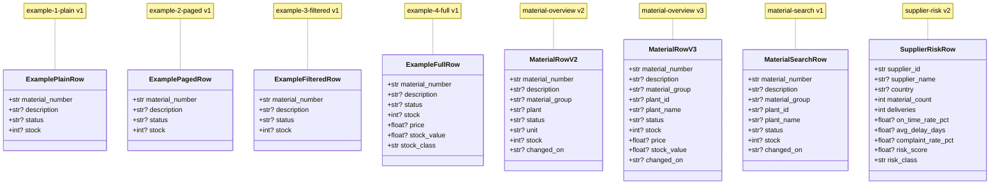

# Architecture (generated)

> This file is generated from the running app by
> `python -m architecture`. **Do not edit by hand** -- changes are
> lost on the next run. The reasoning behind the design is in
> [`api_layer_concept.md`](api_layer_concept.md).

8 data products · 14 routes

## Contracts

The fields the dashboards rely on.

## Write routes

Hand-written, not generated -- a write is an ACTION with preconditions,
a status code of its own and side effects, which a generator cannot
usefully produce (see `api/v1/mappings.py`). What it CAN do is make sure
nothing is forgotten: the role and the invalidation below are declared as
route dependencies, `tests/test_architecture.py` fails the build if either
is missing, and this table is read back off those same declarations.

**Writes to** is read from the handler body via the AST -- empty means the
route does not touch a data source yet. **Invalidates** names the read
products whose cached answer this write makes stale; forgetting one shows
the user the old value and makes them believe the save failed.

| Route | Method | Role | Writes to | Invalidates |
|---|---|---|---|---|
| `/api/v1/mappings` | POST | material-planner | – | material-overview |
| `/api/v1/mappings/{mapping_id}` | PATCH | material-planner | – | material-overview |

## Route inventory

| Route | Methods | Product | Version | Owner | Cache | Status | Sunset |
|---|---|---|---|---|---|---|---|
| `/api/v1/catalog` | GET | – | – | – | – | active | – |
| `/api/v1/catalog/{name}` | GET | – | – | – | – | active | – |
| `/api/v1/data-products/example-1-plain/latest` | GET | example-1-plain | 1.0 | team-material-management | 60s | alias | – |
| `/api/v1/data-products/example-1-plain/v1` | GET | example-1-plain | 1.0 | team-material-management | 60s | active | – |
| `/api/v1/data-products/example-2-paged/latest` | GET | example-2-paged | 1.0 | team-material-management | 30s | alias | – |
| `/api/v1/data-products/example-2-paged/v1` | GET | example-2-paged | 1.0 | team-material-management | 30s | active | – |
| `/api/v1/data-products/example-3-filtered/latest` | GET | example-3-filtered | 1.0 | team-material-management | 60s | alias | – |
| `/api/v1/data-products/example-3-filtered/v1` | GET | example-3-filtered | 1.0 | team-material-management | 60s | active | – |
| `/api/v1/data-products/example-4-full/latest` | GET | example-4-full | 1.0 | team-material-management | 30s | alias | – |
| `/api/v1/data-products/example-4-full/v1` | GET | example-4-full | 1.0 | team-material-management | 30s | active | – |
| `/api/v1/data-products/material-overview/latest` | GET | material-overview | 3.0 | team-material-management | 60s | alias | – |
| `/api/v1/data-products/material-overview/v2` | GET | material-overview | 2.1 | team-material-management | 60s | retiring | 2026-12-31 |
| `/api/v1/data-products/material-overview/v3` | GET | material-overview | 3.0 | team-material-management | 60s | active | – |
| `/api/v1/data-products/material-search/latest` | GET | material-search | 1.0 | team-material-management | 30s | alias | – |
| `/api/v1/data-products/material-search/v1` | GET | material-search | 1.0 | team-material-management | 30s | active | – |
| `/api/v1/data-products/supplier-risk/latest` | GET | supplier-risk | 2.0 | team-supply-chain | 300s | alias | – |
| `/api/v1/data-products/supplier-risk/v2` | GET | supplier-risk | 2.0 | team-supply-chain | 300s | active | – |
| `/api/v1/healthz` | GET | – | – | – | – | active | – |
| `/api/v1/mappings` | POST | – | – | – | – | active | – |
| `/api/v1/mappings/{mapping_id}` | PATCH | – | – | – | – | active | – |
| `/api/v1/readyz` | GET | – | – | – | – | active | – |

## Data products in detail

### `example-1-plain` v1 (1.0)

TEMPLATE 1: every row, no filters, no paging in the query

* **Owner:** team-material-management
* **Sources:** neo4j
* **Cache:** 60s
* **Filters:** `limit`, `offset`
* **Module:** `products/catalog/example_1_plain.py`

### `example-2-paged` v1 (1.0)

TEMPLATE 2: paging in the query, no filters

* **Owner:** team-material-management
* **Sources:** neo4j
* **Cache:** 30s
* **Filters:** `limit`, `offset`
* **Module:** `products/catalog/example_2_paged.py`

### `example-3-filtered` v1 (1.0)

TEMPLATE 3: filters in the query, router does the paging

* **Owner:** team-material-management
* **Sources:** neo4j
* **Cache:** 60s
* **Filters:** `limit`, `offset`, `status`, `min_stock`
* **Module:** `products/catalog/example_3_filtered.py`

### `example-4-full` v1 (1.0)

TEMPLATE 4: filters and paging in the query, plus a transform

* **Owner:** team-material-management
* **Sources:** neo4j
* **Cache:** 30s
* **Filters:** `limit`, `offset`, `status`, `min_stock`, `sort`
* **Module:** `products/catalog/example_4_full.py`

### `material-overview` v2 (2.1)

Material master data for the overview table

* **Owner:** team-material-management
* **Sources:** neo4j
* **Cache:** 60s
* **Filters:** `limit`, `offset`, `status`, `plant`, `material_group`, `unclassified_only`, `search`
* **Module:** `products/catalog/material_overview_v2.py`

### `material-overview` v3 (3.0)

Material master data including stock value

* **Owner:** team-material-management
* **Sources:** neo4j
* **Cache:** 60s
* **Filters:** `limit`, `offset`, `status`, `plant_id`, `material_group`, `unclassified_only`, `search`, `min_stock_value`
* **Module:** `products/catalog/material_overview_v3.py`

### `material-search` v1 (1.0)

Paged material search -- filtered, sorted and windowed in the graph

* **Owner:** team-material-management
* **Sources:** neo4j
* **Cache:** 30s
* **Filters:** `limit`, `offset`, `status`, `plant_id`, `material_group`, `unclassified_only`, `min_stock`, `search`, `sort`
* **Module:** `products/catalog/material_search_v1.py`

### `supplier-risk` v2 (2.0)

Supplier risk from master data (Neo4j) and delivery reliability (Postgres)

* **Owner:** team-supply-chain
* **Sources:** neo4j + postgres
* **Cache:** 300s
* **Filters:** `limit`, `offset`, `since`, `tolerance_days`, `min_deliveries`, `risk_class`, `country`
* **Module:** `products/catalog/supplier_risk_v2.py`

