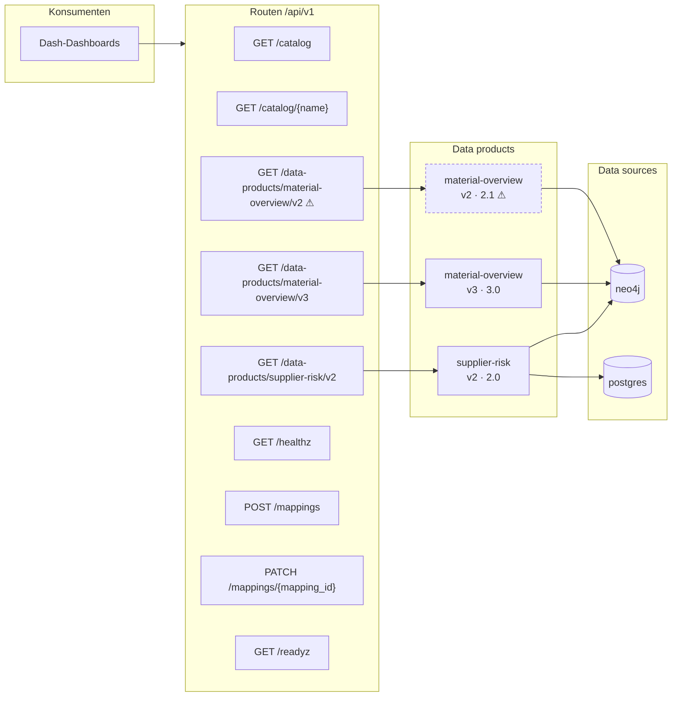
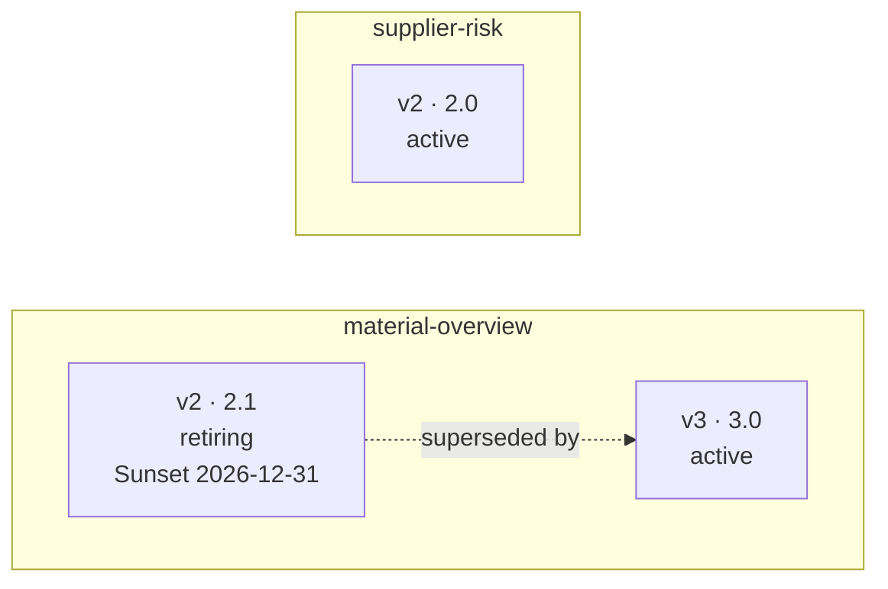
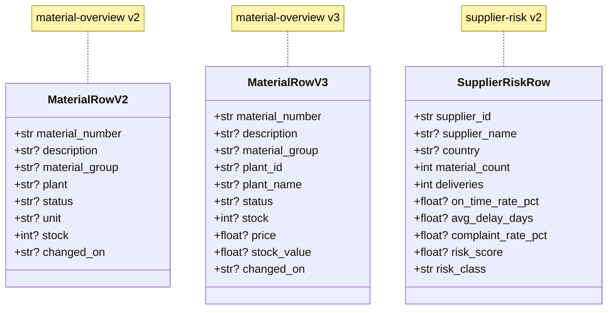

# Architecture (generated)

> This file is generated from the running app by
> `python -m data_api.architecture`. **Do not edit by hand** -- changes are
> lost on the next run. The reasoning behind the design is in
> [`api_layer_concept.md`](api_layer_concept.md).

3 data products · 9 routes

## Data flow

From the route through the data product to the data source.
⚠ marks versions that are being retired.

## Version states

## Contracts

The fields the dashboards rely on.

## Route inventory

| Route | Methods | Product | Version | Owner | Cache | Status |
|---|---|---|---|---|---|---|
| `/api/v1/catalog` | GET | – | – | – | – | active |
| `/api/v1/catalog/{name}` | GET | – | – | – | – | active |
| `/api/v1/data-products/material-overview/latest` | GET | material-overview | 3.0 | team-material-management | 60s | alias |
| `/api/v1/data-products/material-overview/v2` | GET | material-overview | 2.1 | team-material-management | 60s | retiring |
| `/api/v1/data-products/material-overview/v3` | GET | material-overview | 3.0 | team-material-management | 60s | active |
| `/api/v1/data-products/supplier-risk/latest` | GET | supplier-risk | 2.0 | team-supply-chain | 300s | alias |
| `/api/v1/data-products/supplier-risk/v2` | GET | supplier-risk | 2.0 | team-supply-chain | 300s | active |
| `/api/v1/healthz` | GET | – | – | – | – | active |
| `/api/v1/mappings` | POST | – | – | – | – | active |
| `/api/v1/mappings/{mapping_id}` | PATCH | – | – | – | – | active |
| `/api/v1/readyz` | GET | – | – | – | – | active |

## Data products in detail

### `material-overview` v2 (2.1)

Material master data for the overview table

* **Owner:** team-material-management
* **Sources:** neo4j
* **Cache:** 60s
* **Filters:** `limit`, `offset`, `status`, `plant`, `material_group`, `unclassified_only`, `search`
* **Module:** `data_api/products/catalog/material_overview_v2.py`

### `material-overview` v3 (3.0)

Material master data including stock value

* **Owner:** team-material-management
* **Sources:** neo4j
* **Cache:** 60s
* **Filters:** `limit`, `offset`, `status`, `plant_id`, `material_group`, `unclassified_only`, `search`, `min_stock_value`
* **Module:** `data_api/products/catalog/material_overview_v3.py`

### `supplier-risk` v2 (2.0)

Supplier risk from master data (Neo4j) and delivery reliability (Postgres)

* **Owner:** team-supply-chain
* **Sources:** neo4j + postgres
* **Cache:** 300s
* **Filters:** `limit`, `offset`, `since`, `tolerance_days`, `min_deliveries`, `risk_class`, `country`
* **Module:** `data_api/products/catalog/supplier_risk_v2.py`

