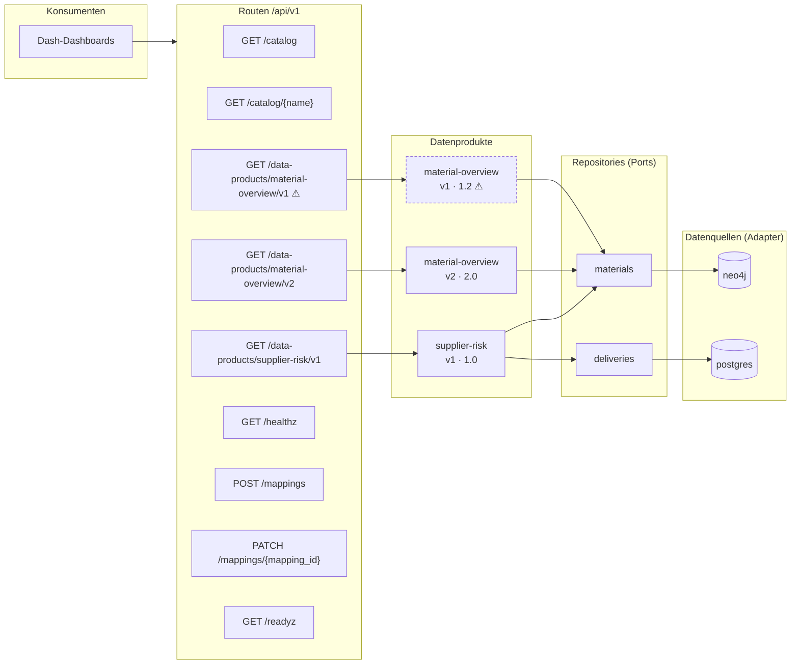
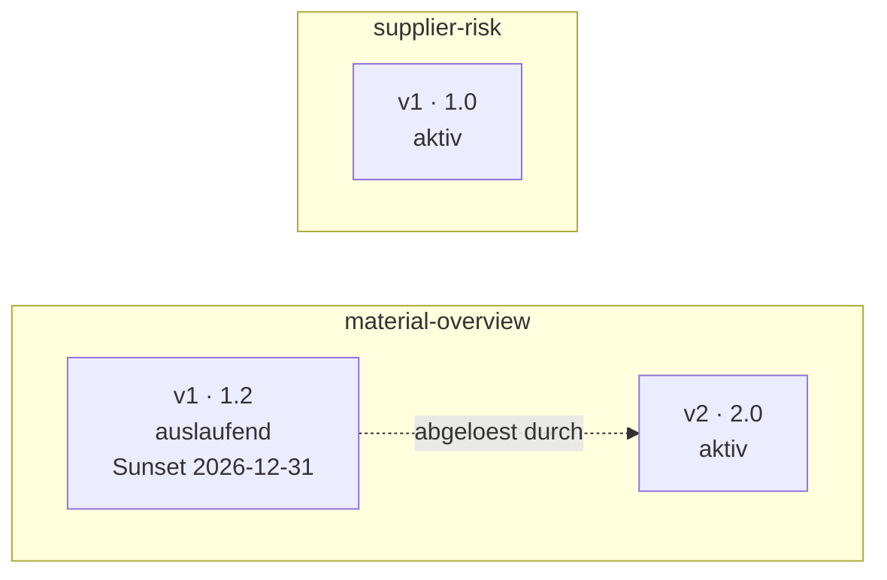
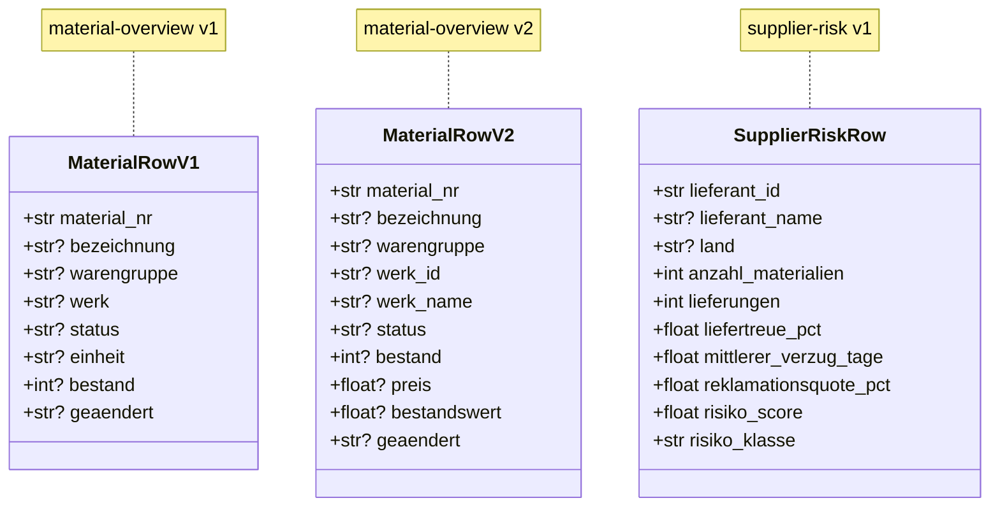

# Architektur (automatisch erzeugt)

> Diese Datei wird von `python -m data_api.architecture` aus der laufenden
> App erzeugt. **Nicht von Hand bearbeiten** -- Aenderungen gehen beim
> naechsten Lauf verloren. Das Konzept dahinter steht in
> [`api_layer_concept.md`](api_layer_concept.md).

Stand: 2026-08-20 · 3 Datenprodukte · 9 Routen

## Datenfluss

Von der Route bis zur Datenquelle. ⚠ markiert auslaufende Versionen.

## Versionsstaende

## Vertraege

Die Felder, auf die sich die Dashboards verlassen.

## Routeninventar

| Route | Methoden | Produkt | Version | Owner | Cache | Status |
|---|---|---|---|---|---|---|
| `/api/v1/catalog` | GET | – | – | – | – | aktiv |
| `/api/v1/catalog/{name}` | GET | – | – | – | – | aktiv |
| `/api/v1/data-products/material-overview/latest` | GET | material-overview | 2.0 | team-material-management | 60s | Alias |
| `/api/v1/data-products/material-overview/v1` | GET | material-overview | 1.2 | team-material-management | 60s | auslaufend |
| `/api/v1/data-products/material-overview/v2` | GET | material-overview | 2.0 | team-material-management | 60s | aktiv |
| `/api/v1/data-products/supplier-risk/latest` | GET | supplier-risk | 1.0 | team-supply-chain | 300s | Alias |
| `/api/v1/data-products/supplier-risk/v1` | GET | supplier-risk | 1.0 | team-supply-chain | 300s | aktiv |
| `/api/v1/healthz` | GET | – | – | – | – | aktiv |
| `/api/v1/mappings` | POST | – | – | – | – | aktiv |
| `/api/v1/mappings/{mapping_id}` | PATCH | – | – | – | – | aktiv |
| `/api/v1/readyz` | GET | – | – | – | – | aktiv |

## Datenprodukte im Detail

### `material-overview` v1 (1.2)

Materialstammdaten fuer die Uebersichtstabelle

* **Owner:** team-material-management
* **Quelle:** neo4j (ueber materials)
* **Cache:** 60s
* **Filter:** `limit`, `offset`, `status`, `werk`, `warengruppe`, `ohne_klassifizierung`, `suche`
* **Modul:** `data_api/products/catalog/material_overview_v1.py`

### `material-overview` v2 (2.0)

Materialstammdaten inkl. Bestandswert

* **Owner:** team-material-management
* **Quelle:** neo4j (ueber materials)
* **Cache:** 60s
* **Filter:** `limit`, `offset`, `status`, `werk_id`, `warengruppe`, `ohne_klassifizierung`, `suche`, `min_bestandswert`
* **Modul:** `data_api/products/catalog/material_overview_v2.py`

### `supplier-risk` v1 (1.0)

Lieferantenrisiko aus Stammdaten (Neo4j) und Liefertreue (Postgres)

* **Owner:** team-supply-chain
* **Quelle:** neo4j + postgres (ueber deliveries, materials)
* **Cache:** 300s
* **Filter:** `limit`, `offset`, `seit`, `toleranz_tage`, `min_lieferungen`, `risiko_klasse`
* **Modul:** `data_api/products/catalog/supplier_risk_v1.py`

